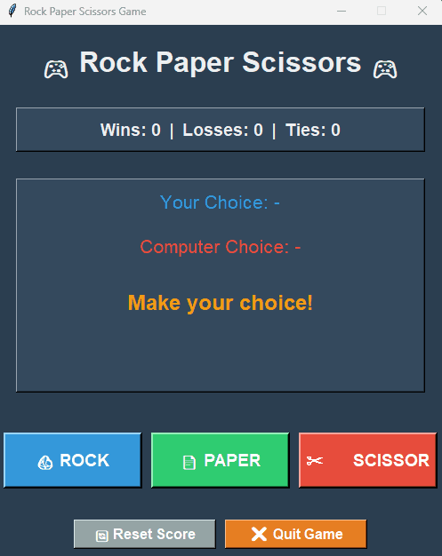

# 🎮 Rock Paper Scissors Game


A modern, interactive Rock-Paper-Scissors game built with Python and Tkinter, featuring a beautiful GUI interface, real-time score tracking, and standalone executable distribution.

## 🎬 Demo



## ✨ Features

- 🎨 **Modern GUI Interface** - Beautiful dark-themed interface with custom icon
- 🎯 **Real-time Score Tracking** - Keep track of wins, losses, and ties across multiple rounds
- 🎮 **Intuitive Controls** - Large, colorful buttons with emoji icons for easy gameplay
- 🎊 **Visual Feedback** - Color-coded results (green for wins, red for losses, orange for ties)
- 🔄 **Reset Functionality** - Reset your score anytime with confirmation dialog
- 💻 **Dual-Mode Support** - Play with GUI (default) or console mode
- 📦 **Standalone Executable** - No Python installation required for the .exe version
- 🪨📄✂️ **Classic Gameplay** - Traditional Rock-Paper-Scissors rules

## 🚀 Quick Start

### Option 1: Download Pre-built Executable (Windows)

**No Python installation required!**

1. Go to [Releases](https://github.com/son31dt/rock_paper_scissor_python/releases)
2. Download `RockPaperScissors.exe` from the latest release
3. Double-click the executable to start playing
4. Enjoy! 🎉

### Option 2: Run from Source Code

**Requirements:**
- Python 3.8 or higher
- tkinter (included with most Python installations)

**Installation:**

```bash
# Clone the repository
git clone git@github.com:son31dt/rock_paper_scissor_python.git

# Navigate to project directory
cd rock_paper_scissor_python

# Run the game
python src/rock_paper_scissor.py
```

## 🎯 How to Play

### GUI Mode (Default)

1. **Launch the game** - Run the executable or Python script
2. **Choose your move** - Click on 🪨 ROCK, 📄 PAPER, or ✂️ SCISSOR
3. **View results** - See both your choice and the computer's choice with the round winner
4. **Track your score** - Wins, losses, and ties are displayed in real-time
5. **Reset anytime** - Click 🔄 Reset Score to start fresh
6. **Quit when done** - Click ❌ Quit Game to see your final score

### Console Mode (Alternative)

To enable console mode, edit [`src/rock_paper_scissor.py`](src/rock_paper_scissor.py):

```python
if __name__ == "__main__":
    play_game()      # Uncomment this line
    # start_gui()    # Comment this line
```

Then run:
```bash
python src/rock_paper_scissor.py
```

Follow the text prompts to enter your choice (`rock`, `paper`, or `scissor`) or type `quit` to exit.

## 🛠️ Tech Stack

- **Language**: Python 3.8+
- **GUI Framework**: Tkinter (standard library)
- **Build Tool**: PyInstaller 6.0+
- **Version Control**: Git

## 🎮 Game Rules

Classic Rock-Paper-Scissors rules:

- 🪨 **Rock** crushes ✂️ Scissors
- 📄 **Paper** covers 🪨 Rock
- ✂️ **Scissors** cuts 📄 Paper

## 📄 License

This project is licensed under the MIT License - see the [LICENSE](LICENSE) file for details.

## 👨‍💻 Author

**Daniel Son**
- GitHub: [@son31dt](https://github.com/son31dt)
- Repository: [rock_paper_scissor_python](https://github.com/son31dt/rock_paper_scissor_python)

## 🙏 Acknowledgments

- Built as a learning project to practice Python GUI development
- Emoji icons from Unicode standard
- Color scheme inspired by modern flat design principles

## 📝 Version History

### v1.0.0 (Initial Release)
- ✨ Modern Tkinter GUI with custom icon
- 🎯 Real-time score tracking
- 🎨 Color-coded results
- 💻 Dual-mode support (GUI + Console)
- 📦 Standalone executable distribution

---

**Made with ❤️ and Python** | **Play responsibly!** 🎮
